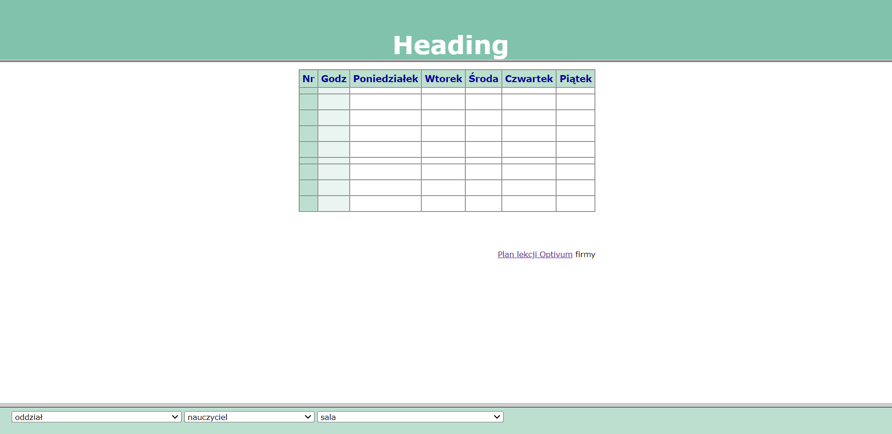

# DISCLAIMER

<b style="color: red">This is a hobby project. I'm not a professional and do not take responsibility for this program's functionality.</b>

# List of contents

- <a href="#about">About</a>
- <a href="#how-to-run">How to run</a>
- <a href="#scripts">Scripts</a>
- <a href="#config-options">Config Options</a>
- <a href="#contributing">Contributing</a>

# About

This API scrapes Vulcan-generated timetables. I've seen there are a few layouts of the timetable page but I have only tested the layout shown below:



This project uses [Cheerio](https://cheerio.js.org) for scraping timetables and [Elysia](https://elysiajs.com) for API

The code is a mess because working with this timetable was an awful experience. Any PRs are welcome.

# How to run

### 1. Fill the `.env` file as shown in `.env.example`

`TIMETABLES_URL` must point to a public Apache directory where all timetables are hosted.

### 2. Run

Start:

```shell
bun start
```

---

Dev:

```shell
bun dev
```

# Scripts

Everything scrapes at the start and every 10 minutes by default (see <a href="#config-options">Config Options</a> for more info)

### Available scripts

scrape

```bash
bun scrape (optional)<option>
```

Available options: ids, infos, timetables.
If not provided, scrapes everything.

# Swagger

Swagger is available on /swagger

# Config Options

Go to `src/config.ts` to see the config object.

- timetablesUrl - Can put it here or in the `.env`
- showApiCalls - If you want to see each request API makes to the timetables endpoint in the console
- scrapeOnStart - If you want to scrape on start
- cron:
  - enabled - If you want to scrape automatically
  - pattern - Cron pattern

# Contributing

You can either touch grass or this code. Choose wisely. Of course, any PRs are welcome.
